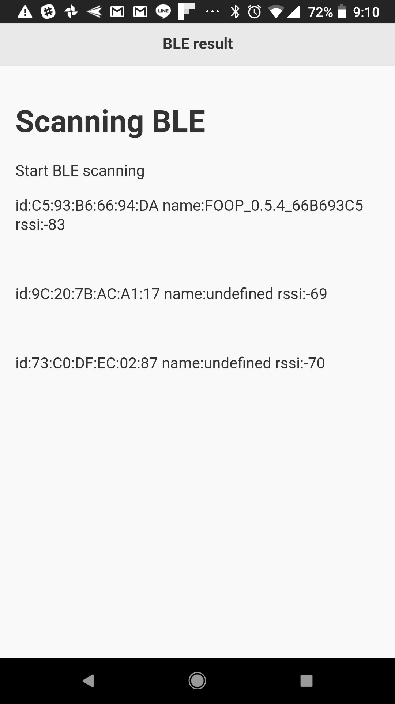

# Tac App Builder
Tac, as part of Tic-Tac-Toe offering, is the app client that interacts with cloud (Tic) and embedded (Toe) systems.  Leveraging powerful mobile phonhe OSes today, you can present and help user interact with rich and complex information about the IOT service you're trying to build.  An Tac app is usually built with hybrid app architecture.  It's a simple and fast way to build app thesedays.  The UI could be made with matured web/HTML5 technologies.  The native layer could be programmed natively or rely on frameworks such as Apache Cordova.

## Quickstart (with Docker)
1. Obtain prebuilt image, around 2GB in gzip.  Or build using `dockerfile/build.sh` in this repo; then you can jump directly to step 3.
1. Run `gzcat tac-builder.gz | docker load`.  You can also run `gzcat | pv | docker load` to see the progress
1. Run `source alias.sh` to load command alias
1. Make simple screen definition in YAML or use `sample.yaml` in this project.  (Re)name it as `myapp01.yaml`
1. `tac-gen myapp01.yaml`
1. `cd myapp01`
1. `tac-build`
1. Install `./myapp01/platforms/android/build/outputs/apk/android-debug.apk` to an Android phone and run it.

## Installation (if not using Docker)
Install and configure following tools.

```
nodejs: v8.9.0
npm: v3.5.2
cordova: 7.1.0
android build tools: 27.0.0
android sdk: r25.2.5
java 8 SDK: 1.9.0_111
```

`git clone https://github.com/t2t-io/tac-builder.git`

`cd tac-builder`

`npm install -g`

## Demo
### demo 1 - basic screen/page definition in Excel sheet
[demo1 video](https://youtu.be/JX1qqgR33K8)

### demo 2 - present dynamic list
[demo2 video](https://youtu.be/xaLqJl_iDtI)

#### transcript
```
demo 2
dynamic content example
in this demo, we will try to present the json objects in dynamic list
firstly, let's create simple screens to explain about the scanning and present the scan result
the key is to leave a div tag with id so that javascript code can locate it
let's use id 'el-list'
save the spread sheet as demo2.xlsx and generate it again using command tac-gen
then go to the project folder demo2/www/js
and append the sample code sample_list.js to the file index.js
launch local web server and check the result
you can see the json object has been enumerated on the screen
```

#### commands for demo 2
1. `cd ./demo`
1. `tac-gen demo2.xlsx`
1. `cat sample_list.js >> demo2/www/js/index.js`
1. `cd demo2`
1. `tac-build` (for Android)
or `cd platforms/ios` and `xcodebuild` for iOS

### demo 3 - search local server and get object to present
[demo3 video](https://youtu.be/fXA1zYTDv1w)

transcript
```
demo 3
next, let's extend the app functionality to find a server in local network and query for latest object data
firstly, let's revise base on demo 2 screen definition
in s02, change the header with id so that javascript code can use it to reflect actual discovery result
it's either string 'scanning' or the ip address found from scannning
we can keep el_list id unchanged
save into demo3.xlsx and run tac-gen to generate new project folder
in www/js folder, replace index.js with content of sample_localserver.js
the code include bonjour browse behavior and also the dynamic list generation from demo 2
build and install the app to mobile phone
on the PC where you git clone tac-builder, go into toe-simple and run `node index.js`
this is a simple server that broadcast it's IP address and also a simple API to return scan result object in JSON
open the app on your phone, it should be able to discover the IP address of your server in the same local network (subnet) and get scan result data as JSON
```

#### commands for demo 3
1. `cd ./demo`
1. `tac-gen demo3.xlsx`
1. `cp sample_localserver.js demo3/www/js/index.js`
1. `cd demo3`
1. `tac-build` (for Android)
or `cd platforms/ios` and `xcodebuild` for iOS
1. install the apk or ipa
1. `cd toe-simple`
1. `npm install`
1. `node index.js`
1. launch the app and check if local server being discovered in the same subnet

### demo 4 - scan local lan for devices and report to app
Use the app from demo3 while launch a different server code in `demo/toe-simple`, `node echo-server.js`.  It will start to scan subnet using ECHONet Lite standard.  When it get ESV code `0x72` (Property value read response (Get_Res)), it will parse the result in scanResult JSON object and wait for the app to query the result.  On the app side, you can add some logic to check timestap of the scan result and finetune the presentation.

#### commands for demo 4
1. `cd demo/toe-simple`
1. `node echo-server.js`
1. launch the app from demo 3 and see if dynamic scan show on app
You might want to connect the PC running `echo-server.js` to some network with real ECHONet Lite devices; or launch the Moekaden demo written in Processing to emulate such devices.

### demo 5 - BLE scan
Usage the app from demo4, add a button start BLE scanning and another screen to show the scan results.

### commands for demo 5
1. `cd demo`
1. `tac-gen demo5.yaml`
1. `cp sample_ble.js demo5/www/js/index.js`
1. `tac-build`
1. Instal and run the apk/ipa to your phone. Grant the BLE permission.  The result should be like following screenshot.



## Usage
You can define your app screen/page flow in yaml or Excel(tm) sheet. 

### Generate SPA (single page app) from yaml definition

`tac-spa NAME.yaml`

This command will generate a SPA html file `NAME.html`

### Generate SPA from xlsx definition
`tac-spa NAME.xlsx`
This command will generate a yaml definition `NAME.yaml` and a SPA html file `NAME.html` as result.

### Generate ready to build iOS and Android project folders
`tac-gen NAME.yaml/xlsx`
This command will generate project folders ready to build by Android and iOS SDK tools.

### Build with Android SDK (by tac-builder docker image)
`tac-build`
This commnad should be issued inside project folder.  It will use the Android SDK installed inside docker image to build the project.  Result `apk` file ready to be tested on mobile phone will be placed under `[NAME]/platforms/android/build/outputs/apk`.

### Build with iOS SDK
Just issue `xcodebuild` command under the generated project folder for iOS platform.  Pattern of the folder is `[NAME]/platforms/ios/`.  Please note that you should use Xcode IDE GUI to select proper provisioning profile first so that `xcodebuild` CLI could be executed properly.


## YAML definition

sample YAML definition


Then you can issue following command to generate the html page for your app:
`node genSpa.js YAML_FILE > index.html`

Try to open the `index.html` with any browser, you can see the generated single page app.


## Excel definition
You can use your spreadsheet program to create a screen/page definition sheet like following:


(`sample.xlsx` in this repository could also be used as a starting point to build your screen sheet.)

Save it and then issue following command to generate the YAML definition.  Then you can feed it to `genSpa.js` as shown in last step.
`node xlsx2yaml XLSX_FILE > OUTPUT.yaml`


## Optional configurations
### `config_head_template.txt`
If this file exists in the same folder as your XLSX/YAML when you invoke `tac-spa`, `tac-gen` or `tac-spa-update`, tac-builder will use its content to initialize HTML <head> element.  Otherwise it will use default template.

### `config_plugin.txt`
If this file exists in the same folder as your XLSX/YAML when you invoke `tac-gen`, tac-builder will use its content to install cordova plug-ins as specified.  The file is a line based list of plugin names:
```
cordova-plugin-zeroconf
cordova-plugin-ble-central
```

## Other handy tools
`phantomjs`: helps with automation and screeshots
`http-server`: for localhost tests; you can rut it in `www` folder of the generated project


## Caveat
1. Please use `dockerfile/update.sh` to update the installed image. Sometimes after the update the `tac-spa`, `tac-gen` and `tac-build` would emit error message like `module / depedency not found`.  Please run `dockerfile/update.sh` again to correct this.  This is a known npm install issue.
1. `tac-spa` will generate .xlsx or .yaml file into .html with the same name.  However `tac-gen` will generate the input files into `./[project_name]/www/index.html`.  If you do `tac-spa` later in the project, please copy the file into `./[project_name]/www/index.html` manually. UPDATE: a new script has been added in alias.sh called `tac-spa-update`.  You can use this script to generate html and also copy it into the project folder's `www/index.html`

## Code management
With project folder generaetd by tac-builder, here are some suggestions about code management.

Initially, source materials and project folder would like like:

```
[PROJECT-NAME].xlsx
[PROJECT-NAME].yaml
[JS_CODE].js
	./[PROJECT-NAME]
		./platforms
		./www
			./index.html
			./css
			./img
			./js
				./index.js
```

During the stage when there are still frequent changes to screen/page flow, the XLSX and/or YAML file will be chagned quite a lot.  You can use `tac-spa-update` command to update the revised XLSX/YAMLL into ./[PROJECT-NAME]/www/index.html.   And the resources including javasript code could be tracked and managed at the same level (eg. as `source-www`) and then copied into [PROJECT-NAME]/www/ with respectively.

Once project structure is matured (ie. less need to change screen flow, etc), you can consider to add [PROJECT-NAME] into your code management system while ignore `platforms` folder for most of the content are machine generated.

When app is loaded into mobilephone, the root of URI would be `www`.  Hence for example, a typical image reference could be added as HTML ``

Certinaly you can also put [PROJECT-NAME] folder into code management as early as possible.