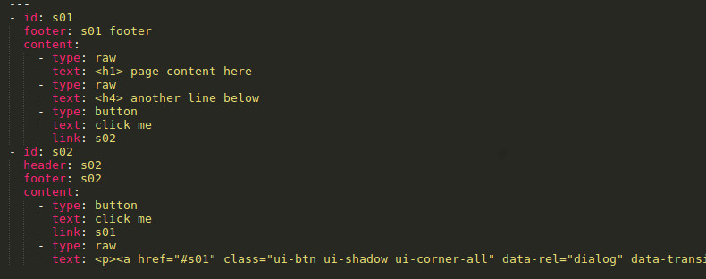
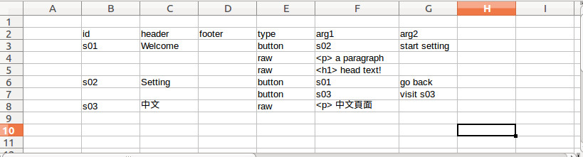

# Tac App Builder
Tac, as part of Tic-Tac-Toe offering, is the app client that interacts with cloud (Tic) and embedded (Toe) systems.  Leveraging powerful mobile phonhe OSes today, you can present and help user interact with rich and complex information about the IOT service you're trying to build.  An Tac app is usually built with hybrid app architecture.  It's a simple and fast way to build app thesedays.  The UI could be made with matured web/HTML5 technologies.  The native layer could be programmed natively or rely on frameworks such as Apache Cordova.

## Quickstart (with Docker)
1. Obtain prebuilt image, around 2GB in gzip.  Or build using `dockerfile/build.sh` in this repo; then you can jump directly to step 3.
1. Run `gzcat | docker load`.  You can also run `gzcat | pv | docker load` to see the progress
1. Run `source alias.sh` to load command alias
1. Make simple screen definition in YAML or use `sample.yaml` in this project.  (Re)name it as `myapp01.yaml`
1. `tac-gen myapp01.yaml`
1. `cd myapp01`
1. `tac-build`
1. Install `./myapp01/platforms/android/build/outputs/apk/android-debug.apk` to an Android phone and run it.

## Installation (if not using Docker)
Install and configure following tools.

```
nodejs: v8.9.0
npm: v3.5.2
cordova: 7.1.0
android build tools: 27.0.0
android sdk: r25.2.5
java 8 SDK: 1.9.0_111
```

`git clone https://github.com/t2t-io/tac-builder.git`

`cd tac-builder`

`npm install -g`

## Demo
### demo 1 - basic screen/page definition in Excel sheet
[demo1 video](https://youtu.be/JX1qqgR33K8)

### demo 2 - present dynamic list
[demo2 video](https://youtu.be/xaLqJl_iDtI)

### demo 3 - search local server and get object to present
[demo3 video](https://youtu.be/fXA1zYTDv1w)

### demo 4 - scan local lan for devices and report to app
Use the app from demo3 while launch a different server code in `demo/toe-simple`, `node echo-server.js`.  It will start to scan subnet using ECHONet Lite standard.  When it get ESV code `0x72` (Property value read response (Get_Res)), it will parse the result in scanResult JSON object and wait for the app to query the result.  On the app side, you can add some logic to check timestap of the scan result and finetune the presentation.

## Usage
You can define your app screen/page flow in yaml or Excel(tm) sheet. 

### Generate SPA (single page app) from yaml definition

`tac-spa NAME.yaml`

This command will generate a SPA html file `NAME.html`

### Generate SPA from xlsx definition
`tac-spa NAME.xlsx`
This command will generate a yaml definition `NAME.yaml` and a SPA html file `NAME.html` as result.

### Generate ready to build iOS and Android project folders
`tac-gen NAME.yaml/xlsx`
This command will generate project folders ready to build by Android and iOS SDK tools.

### Build with Android SDK (by tac-builder docker image)
`tac-build`
This commnad should be issued inside project folder.  It will use the Android SDK installed inside docker image to build the project.  Result `apk` file ready to be tested on mobile phone will be placed under `[NAME]/platforms/android/build/outputs/apk`.

### Build with iOS SDK
Just issue `xcodebuild` command under the generated project folder for iOS platform.  Pattern of the folder is `[NAME]/platforms/ios/`.  Please note that you should use Xcode IDE GUI to select proper provisioning profile first so that `xcodebuild` CLI could be executed properly.


## YAML definition

sample YAML definition



Then you can issue following command to generate the html page for your app:
`node genSpa.js YAML_FILE > index.html`

Try to open the `index.html` with any browser, you can see the generated single page app.


## Excel definition
You can use your spreadsheet program to create a screen/page definition sheet like following:



(`sample.xlsx` in this repository could also be used as a starting point to build your screen sheet.)

Save it and then issue following command to generate the YAML definition.  Then you can feed it to `genSpa.js` as shown in last step.
`node xlsx2yaml XLSX_FILE > OUTPUT.yaml`


## Other handy tools
`phantomjs`: helps with automation and screeshots
`http-server`: for localhost tests; you can rut it in `www` folder of the generated project


## Caveat
1. Please use `dockerfile/update.sh` to update the installed image. Sometimes after the update the `tac-spa`, `tac-gen` and `tac-build` would emit error message like `module / depedency not found`.  Please run `dockerfile/update.sh` again to correct this.  This is a known npm install issue.
1. `tac-spa` will generate .xlsx or .yaml file into .html with the same name.  However `tac-gen` will generate the input files into `./[project_name]/www/index.html`.  If you do `tac-spa` later in the project, please copy the file into `./[project_name]/www/index.html` manually.
